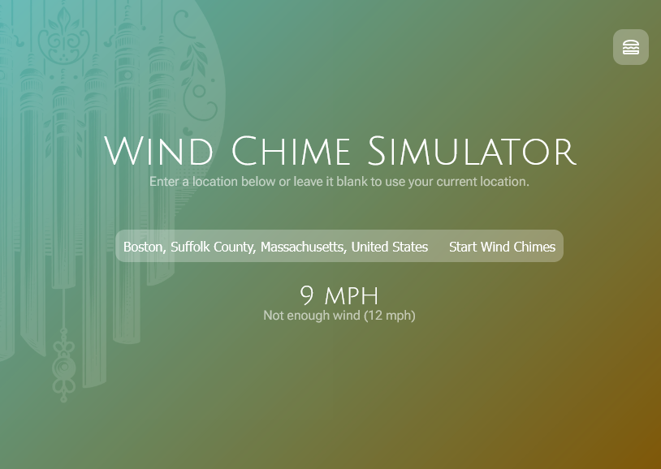

# Wind Chime Simulator

The Wind Chime Simulator is a web-based application that creates a soothing ambient sound experience by simulating the gentle chimes of wind chimes based on real-time weather data from a specified location.

## Features

- Real-time weather data integration
- Customizable chime sounds and scales
- Adjustable wind speed and turbulence settings
- Realistic sound generation based on wind conditions
- Responsive and intuitive user interface

## How to Use

1. Open the Wind Chime Simulator in your web browser.
2. Enter a location (city, state, or country) in the input field or leave it blank to use your current location.
3. Click the "Start Wind Chimes" button to begin the simulation.
4. Adjust the various settings using the sliders in the settings menu to customize your experience.
5. Sit back, relax, and enjoy the calming sounds of the wind chimes!

## Technologies Used

- HTML5
- CSS3
- JavaScript
- Web Audio API
- OpenWeatherMap API (for weather data)

## File Structure

- `index.html`: The main HTML file that structures the web page.
- `assets/styles.css`: The CSS file that defines the styles for the web page.
- `assets/sim.js`: The JavaScript file that contains the logic for the wind chime simulation and API integration.
- `assets/screen.png`: A screenshot of the Wind Chime Simulator interface.

## Credits

The Wind Chime Simulator was created by [Your Name]. It utilizes the OpenWeatherMap API for retrieving real-time weather data.

## License

This project is open-source and available under the [MIT License](LICENSE).