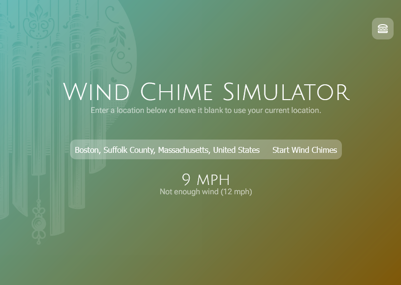

# Wind Chime Simulator

The Wind Chime Simulator is a web-based application that creates a soothing ambient sound experience by simulating the gentle chimes of wind chimes based on real-time weather data from a specified location.

## Features

- Real-time weather data integration
- Customizable chime sounds and scales
- Adjustable wind speed and turbulence settings
- Realistic sound generation based on wind conditions
- Responsive and intuitive user interface

## How to Use

1. Open the Wind Chime Simulator in your web browser.
2. Enter a location (city, state, or country) in the input field or leave it blank to use your current location.
3. Click the "Start Wind Chimes" button to begin the simulation.
4. Adjust the various settings using the sliders in the settings menu to customize your experience.
5. Sit back, relax, and enjoy the calming sounds of the wind chimes!

## Technologies Used

- HTML5
- CSS3
- JavaScript
- Web Audio API
- three.js r185, vendored
- api.weather.gov, the National Weather Service forecast API

## File Structure

- `index.html`: The main HTML file that structures the web page.
- `assets/styles.css`: The CSS file that defines the styles for the web page.
- `assets/js/wind.js`: The wind field. Mean, gust and turbulence, sampled by everything that moves.
- `assets/js/physics.js`: The rig. Plate, tubes, clapper and sail as a constrained particle assembly.
- `assets/js/scene.js`: The picture. Renderer, camera, sky, light, chime meshes and cords.
- `assets/js/windviz.js`: The visible wind. Grass, airborne streaks, leaves and the telltale ribbon.
- `assets/js/audio.js`: Modal synthesis of a struck aluminium tube, driven by strike events.
- `assets/js/weather.js`: Geocoding and the api.weather.gov forecast, with every failure path returning null.
- `assets/js/main.js`: The wiring, the controls and the animation loop.
- `assets/vendor/`: three.js r185, vendored so the page needs no build step and no CDN.
- `assets/screen.png`: A screenshot of the Wind Chime Simulator interface.

## Credits

Built by Myra Krusemark. Forecast data comes from api.weather.gov, run by the National
Weather Service, which does not endorse this project. Rendering uses
[three.js](https://github.com/mrdoob/three.js) under the MIT licence.

## License

Two licences, split by what the file is.

- **Code** is under the [MIT License](LICENSE). That covers the JavaScript, HTML, CSS,
  Python and tooling. Reuse it, keep the copyright notice.
- **Creative assets** are under [CC BY 4.0](LICENSE-ASSETS). That covers the scene and
  environment assets, any authored audio, and the modal synthesis material library,
  meaning the tuned coefficient sets that decide how each material sounds. Reuse those
  with credit and a link to the licence.

[`NOTICE`](NOTICE) states which licence reaches which file. [`ASSETS.md`](ASSETS.md)
records the source and licence of every third-party asset, and the sourcing rules for
adding more.